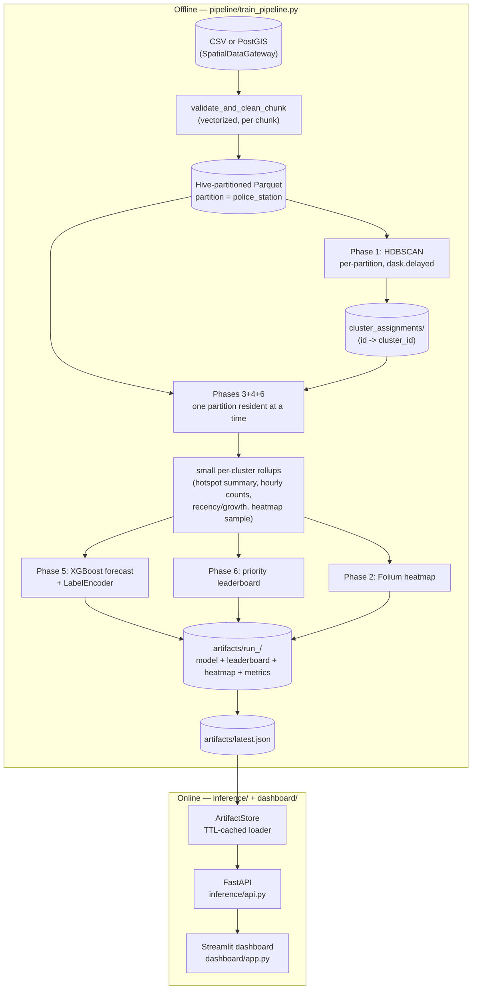

# Parking Congestion Intelligence — Production System

AI-driven parking-violation hotspot detection, impact scoring, forecasting, and enforcement
dispatch for Bengaluru, rebuilt from a single-notebook prototype into a decoupled,
horizontally-scalable, deployable system.

## Architecture

Two processes that never share a Python import graph: an **offline training pipeline**
that turns raw violation data into serialized artifacts, and an **online serving layer**
(API + dashboard) that only ever reads those artifacts. The training pipeline can be
re-run on a schedule, in a separate container, on a fresh data drop — without restarting
or even being aware of the serving layer. The serving layer picks up a new model on its
next cache refresh (`PCI_CACHE_TTL_SECONDS`, default 60s) by re-reading `artifacts/latest.json`.



Row-level data is never fully materialized in memory at any stage: ingestion is chunked,
clustering runs per-jurisdiction partition, and feature engineering streams one partition
at a time, accumulating only small per-cluster rollups. Memory use is bounded by the
largest single partition, not the size of the feed.

## What changed from the prototype

The original `2raw.ipynb` + `app.py` worked end-to-end but had five problems that block
production use; each is fixed in a specific module:

- **Unbounded memory.** A single `pd.read_csv()` plus one full-dataset HDBSCAN pass meant
  memory scaled with total feed size. Fixed by chunked ingestion (`pipeline/data_gateway.py`),
  Hive-partitioned Parquet storage (`pipeline/storage.py`), and spatially-partitioned
  clustering by police jurisdiction (`pipeline/geospatial.py`) — partitions process in
  parallel via `dask.delayed` and memory is bounded by one partition at a time.
- **Meaningless cluster IDs fed to XGBoost as ordinals.** The prototype passed raw HDBSCAN
  labels (which aren't stable across reruns and aren't ordinal) straight into the model as
  a numeric feature. Fixed with a `LabelEncoder`, serialized alongside the model
  (`pipeline/forecasting.py`) — an unseen cluster at inference time is now a clear `422`,
  not silently wrong output.
- **A 19MB heatmap HTML file.** Rendering every raw point into Folium doesn't scale. Fixed
  by point-sampling the raw layer (`PCI_HEATMAP_MAX_POINTS`, default 20,000) while keeping
  hotspot centroid markers exact, since those come from the small aggregated rollup, not
  the raw layer (`pipeline/heatmap.py`).
- **No data validation.** Nulls, zero-island coordinates, out-of-geofence points, and
  malformed timestamps all flowed straight into the model. Fixed with a vectorized
  validation gate (`pipeline/validation.py`) that tracks and reports every rejection reason,
  and aborts a training run if rejection rate exceeds `PCI_MAX_ROW_REJECTION_RATE` (default 25%)
  rather than silently training on a broken feed.
- **The dashboard was 100% hardcoded mock data,** wired to nothing. `dashboard/app.py` is
  now a pure presentation layer with zero local computation — every number comes from
  `inference/api.py` over HTTP, and there is no retrain-on-the-fly code path anywhere in it.

## Repository layout

```
config/             Pydantic Settings — every tunable in one place, env-overridable
schemas/             domain.py (training-time record contract), api.py (serving contract)
pipeline/            Phases 1-6 + orchestrator (train_pipeline.py) — writes artifacts/
inference/           artifact_store.py (TTL-cached loader), service.py, api.py (FastAPI)
dashboard/           app.py — Streamlit, talks to inference/api.py only over HTTP
tests/               pytest — validation, impact scoring, enforcement engine, API
.github/workflows/   CI: lint -> test -> build/push 3 images -> staging deploy
Dockerfile.pipeline  Dockerfile.api  Dockerfile.dashboard
docker-compose.yml
```

## Quickstart

### Local (no Docker)

```bash
python -m venv .venv && source .venv/bin/activate
pip install -r requirements.txt

# Train once — populates artifacts/<run_id>/ and artifacts/latest.json
PCI_CSV_PATH=/path/to/violations.csv python -m pipeline.train_pipeline

# Serve
uvicorn inference.api:app --reload          # http://localhost:8000
streamlit run dashboard/app.py              # http://localhost:8501
```

### Docker Compose

```bash
docker compose run --rm pipeline                # one-shot training job
docker compose up api dashboard                  # bring up the serving stack
docker compose --profile postgis up              # also start a local PostGIS for testing
```

`pipeline` is defined under the `training` profile specifically so `docker compose up`
never starts it — in a real deployment this image is a scheduled job (k8s CronJob, ECS
scheduled task, Airflow operator), not a long-lived service.

## API reference

| Method | Path                          | Description                                          |
|--------|-------------------------------|-------------------------------------------------------|
| GET    | `/health`                     | `ok` / `degraded` + currently-served model version    |
| GET    | `/api/v1/leaderboard?limit=N` | Ranked hotspots with dispatch status + recommendation |
| GET    | `/api/v1/hotspots/{cluster_id}` | Single hotspot detail (404 if unknown)               |
| POST   | `/api/v1/predict`             | `{cluster_id, hour, day_of_week}` → predicted hourly violation volume (422 on unseen cluster) |
| GET    | `/api/v1/feature-importance`  | XGBoost feature weights                                |
| GET    | `/api/v1/kpis`                | Dashboard summary cards                                |
| GET    | `/api/v1/map`                 | The run's heatmap.html                                 |

Every endpoint returns `503` if no training run has completed yet, and request bodies are
Pydantic-validated (`schemas/api.py`) — e.g. `hour` outside `[0, 23]` is rejected before it
reaches the model.

## Configuration

All settings live in `config/settings.py`, are overridable via `PCI_`-prefixed environment
variables, and are documented with defaults in `.env.example`. Nothing in `pipeline/`,
`inference/`, or `dashboard/` hardcodes a path, threshold, or connection string.

## Scaling notes

**Data backend swap (Dask → PostGIS).** `pipeline/data_gateway.py` defines
`SpatialDataGateway` as an abstract contract with two implementations. `DaskBatchGateway`
(default) is fully functional against flat files with zero external infrastructure.
`PostGISGateway` is complete — SQLAlchemy engine, a parameterized `ST_Within`/
`ST_MakeEnvelope` query that pushes geofence filtering into the database, and chunked
`pandas.read_sql` — but **has not been exercised against a live database in this
environment** (no PostGIS instance was available). Switching is `PCI_DATA_BACKEND=postgis`
+ `PCI_POSTGIS_DSN`; no other code changes. `docker compose --profile postgis up` brings up
a real PostGIS instance for testing this path before relying on it in production.

**Dask → Spark/distributed cluster.** The clustering and storage layers already follow
Spark's conventions on purpose: cluster partitioning is by a real-world key (police
jurisdiction), Parquet output is Hive-style partitioned (`<col>=<key>/part-NNNN.parquet`,
identical to what Spark writes), and the per-partition clustering function
(`pipeline/geospatial.py:_cluster_one_partition`) takes a single partition's DataFrame and
returns a small stats object — the same shape a PySpark `mapPartitions` job would use. The
sandbox this was built in has a single CPU core, so `dask.delayed(..., scheduler="threads")`
doesn't get real parallelism here; pointing `dask.compute()` at a distributed scheduler
(`dask.distributed.Client`) or porting the per-partition function to PySpark are both
drop-in changes to `run_partitioned_clustering()`, not a redesign.

**Horizontal scaling of the serving layer.** `inference/api.py` is stateless aside from
the in-process `ArtifactStore` cache, so it scales horizontally behind a load balancer with
no coordination needed — every replica independently re-reads the same `artifacts/latest.json`.

## Testing

```bash
pytest tests/ -v
```

45 tests across data validation (every rejection-reason path), impact scoring (severity
mapping, the density × severity × vehicle-weight × rush-hour formula), the enforcement
engine (recency/growth math, dispatch-status thresholds, leaderboard ranking), and the API
(built against a small but genuinely-trained synthetic artifact bundle, not mocked
responses — exercises the real serialize → deserialize → serve path).

## CI/CD

`.github/workflows/ci-cd.yml`: `ruff check` → `pytest` → build and push all three images to
GHCR (tagged `latest` + commit SHA) → an illustrative staging-deploy job. The deploy step is
a placeholder (no staging target exists for this exercise) — its point is that build/push and
deploy are separate, independently-reviewable jobs, not that any specific deploy tooling was
chosen.

## Honest limitations

- `PostGISGateway` is implementation-complete but untested against a live database (see
  Scaling notes above).
- Benchmarked and validated against a real 298,450-row Bengaluru dataset on a 1-vCPU/4.2GB
  sandbox: full training run completes in ~100s, discovers 5,438 hotspots across 54
  jurisdictions, forecast MAE ≈ 1.5 violations/hour. Numbers will differ on different
  hardware/data.
- pandas 3.0's nullable `Float64` extension dtype boxes values as Python objects under
  `.to_numpy()`, which breaks raw numpy ufuncs (`np.radians` in particular) — `geospatial.py`
  explicitly casts to `float64` before calling into HDBSCAN. Worth knowing if you add new
  numpy-level operations on `latitude`/`longitude` elsewhere in the pipeline.
